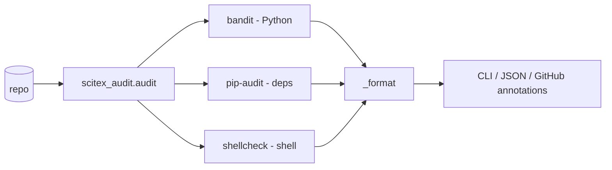

# scitex-audit

<p align="center">
  <a href="https://scitex.ai">
    
  </a>
</p>

<p align="center"><b>Unified security scanning: bandit + shellcheck + pip-audit + GitHub advisories in one report.</b></p>

<p align="center">
  <a href="https://scitex-audit.readthedocs.io/">Full Documentation</a> · <code>uv pip install scitex-audit[all]</code>
</p>

<!-- scitex-badges:start -->
<p align="center">
  <a href="https://pypi.org/project/scitex-audit/"></a>
  <a href="https://pypi.org/project/scitex-audit/"></a>
  <a href="https://scitex-audit.readthedocs.io/"></a>
</p>
<p align="center">
  <a href="https://github.com/ywatanabe1989/scitex-audit/actions/workflows/pytest-matrix-on-ubuntu-py3-11-3-12-3-13.yml"></a>
  <a href="https://github.com/ywatanabe1989/scitex-audit/actions/workflows/import-smoke-on-ubuntu-py3-12.yml"></a>
  <a href="https://codecov.io/gh/ywatanabe1989/scitex-audit"></a>
</p>
<!-- scitex-badges:end -->

---

## Problem and Solution

| # | Problem | Solution |
|---|---------|----------|
| 1 | **4 security tools, different outputs** — bandit (py) + shellcheck (sh) + pip-audit (deps) + GH Advisories each speak their own format; no unified report | **`scitex-audit .`** — runs all four, merges findings into one JSON report; ideal for CI pre-release gates |

## Quick Start

```python
from scitex_audit import audit

# Run all scanners on the current directory.
results = audit(".")

# Run only specific scanners.
results = audit(".", checks=["python", "shell"])

# Or from the CLI:
# $ scitex-audit . --json > report.json
```

## Installation

```bash
uv pip install "scitex-audit[all]"
```

## Architecture


<sub><b>Figure 1.</b> Unified scanning pipeline — one entry point dispatches to four backends and merges results into a single report.</sub>

```
src/scitex_audit/
├── _runner.py        # orchestrates checks, aggregates results
├── _bandit.py        # Python security scanner (bandit)
├── _pip_audit.py     # dependency CVE scanner (pip-audit)
├── _shellcheck.py    # shell script linter (shellcheck)
├── _format.py        # human + JSON output formatting
├── _github.py        # GitHub Actions annotation emitter
└── _skills/          # SciTeX skills metadata
```

## 2 Interfaces

<details open>
<summary><strong>Python API</strong></summary>

<br>

```python
from scitex_audit import audit

# Run all enabled scanners and merge results.
results = audit(".")

# Run only specific scanners.
results = audit(".", checks=["python", "shell"])
```

</details>

<details>
<summary><strong>CLI</strong></summary>

<br>

```bash
scitex-audit .                          # all scanners
scitex-audit . --checks python,shell    # subset
scitex-audit . --json                   # machine-readable
```

</details>

## Environment Variables

| Variable | Default | Purpose |
| --- | --- | --- |
| `SCITEX_AUDIT_DIR` | `~/.scitex/audit/github-alerts/runtime/` (or `<git-root>/.scitex/audit/github-alerts/runtime/` when invoked from inside a git repo) | Where GitHub-alerts reports are written when `scitex-audit github check --save` is used. Honoured verbatim — no `audit/` subdir is appended on top of an explicit path. |
| `SCITEX_DIR` | `~/.scitex` | User-scope SciTeX root. Used as the parent of the `audit/` subtree when `SCITEX_AUDIT_DIR` is not set. |
| `SCITEX_AUDIT_CONFIG` | `~/.scitex/audit/config.yaml` | Optional config-file override (mentioned for parity with sibling scitex-* packages; reserved). |
| `GH_TOKEN` / `GITHUB_TOKEN` | — | Picked up by the `gh` CLI for GitHub API auth. Standard `gh` behaviour; not a scitex-audit-specific knob. |

The legacy `~/.scitex/security/` directory (from scitex-security 0.1.x, absorbed per ADR-0001 in scitex-dev #139) is auto-symlinked into `~/.scitex/audit/github-alerts/` on first import of `scitex_audit` — no manual user step.

## Part of SciTeX

`scitex-audit` is part of [**SciTeX**](https://scitex.ai). Install via
the umbrella with `pip install scitex[audit]` to use as
`scitex.audit` (Python) or `scitex audit ...` (CLI).

>Four Freedoms for Research
>
>0. The freedom to **run** your research anywhere — your machine, your terms.
>1. The freedom to **study** how every step works — from raw data to final manuscript.
>2. The freedom to **redistribute** your workflows, not just your papers.
>3. The freedom to **modify** any module and share improvements with the community.
>
>AGPL-3.0 — because we believe research infrastructure deserves the same freedoms as the software it runs on.

## License

AGPL-3.0 — see [LICENSE](LICENSE) for details.

---

<p align="center">
  <a href="https://scitex.ai" target="_blank"></a>
</p>
